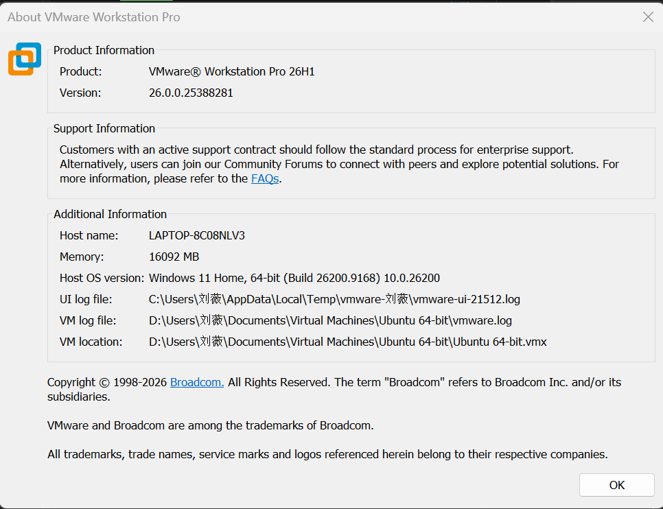
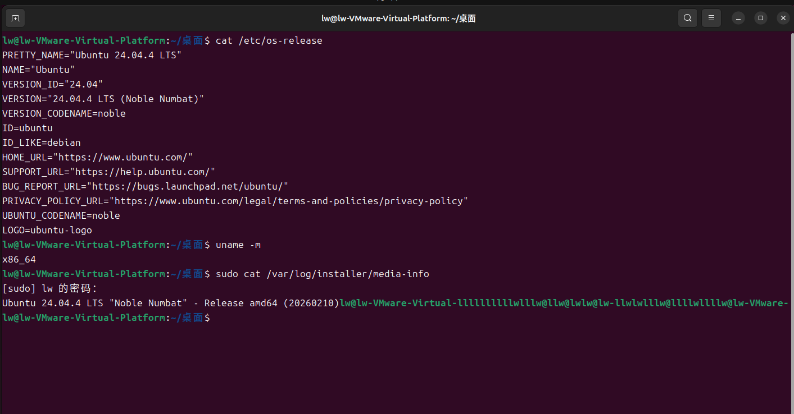
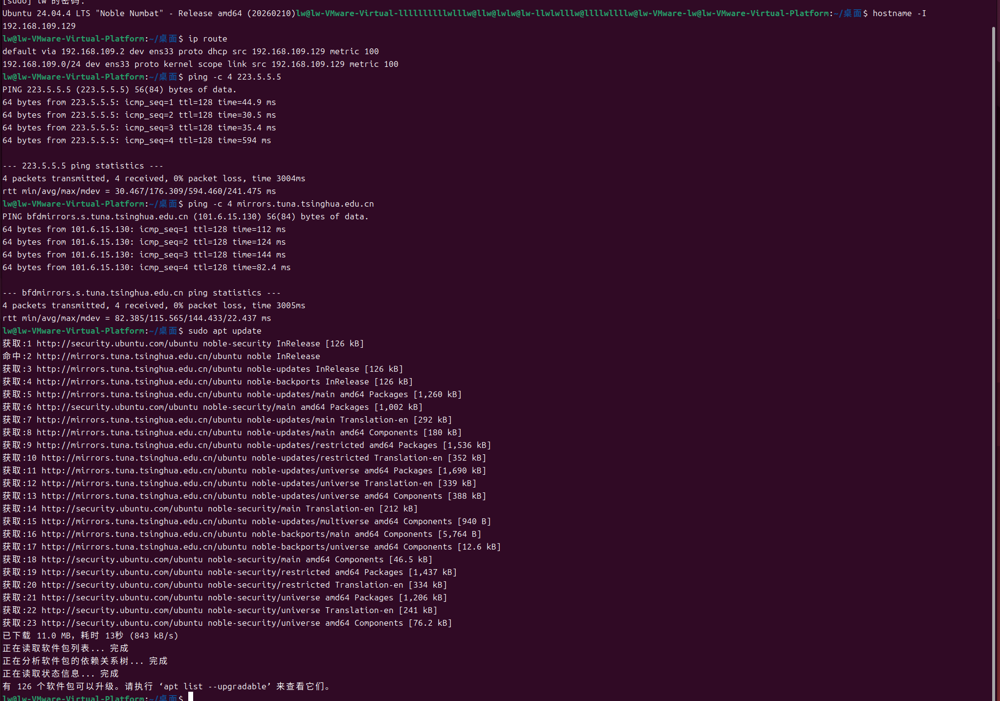
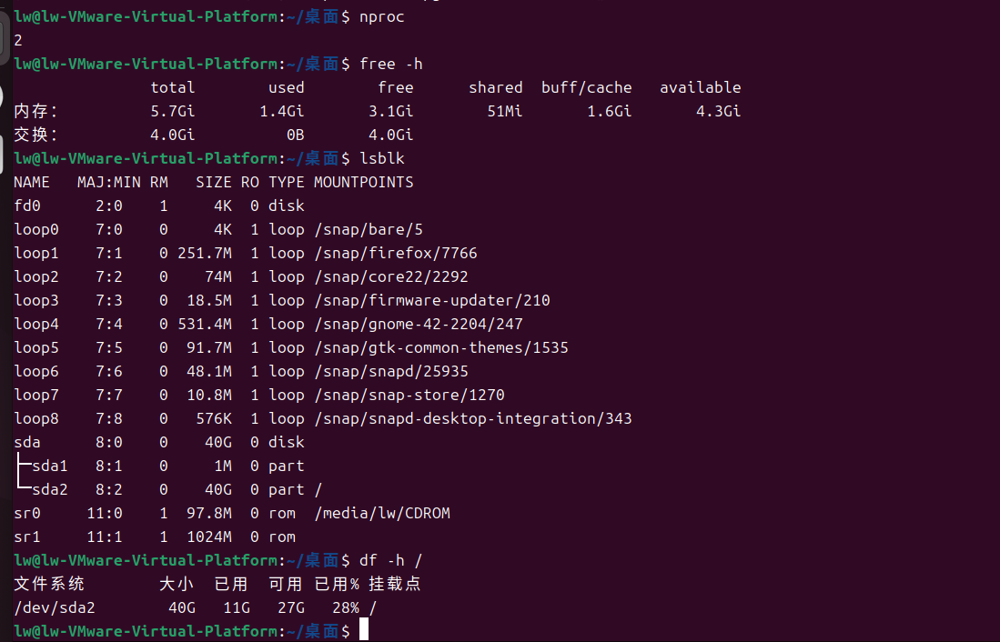
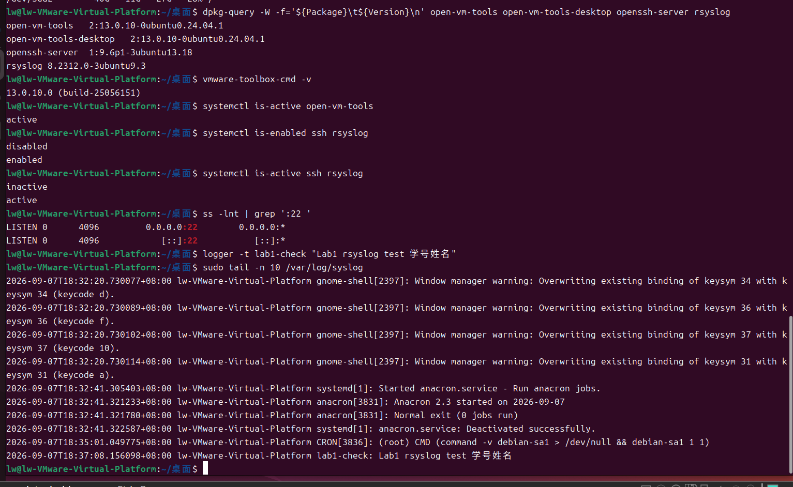

# Lab1：日志实验环境验收

> **作业目标**：用命令输出和截图证明 VMware、Ubuntu、网络、虚拟硬件以及课程必需组件已正确安装。
>
> **前置条件**：已按 [`操作手册.md`](操作手册.md) 完成虚拟机安装、国内软件源配置和基础组件配置。
>
> **命令执行方式**：下面所有命令请**一条一条执行**，每执行一条就先看清它的输出再执行下一条。不要把一节里的命令一次性全部粘贴进终端，否则输出会混在一起，看不出是哪条命令出了问题。

---

## 任务一：检查 VMware 版本

### 第一步：查看版本

在 Windows 中打开 VMware Workstation Pro，在菜单中选择 **Help → About VMware Workstation**，查看版本信息。

教师指定版本为：

```text
VMware Workstation Pro 26H1 for Windows
```

### 第二步：填写检查结果

| 项目 | 你的填写内容 |
| :--- | :--- |
| 已安装的 VMware 完整版本号 | VMware® Workstation Pro 26H1 26.0.0.25388281 |
| 是否为教师指定版本 | 是|



---

## 任务二：检查 Ubuntu 版本

### 第一步：查看当前系统版本

```bash
cat /etc/os-release
```

验收标准：`PRETTY_NAME` 中同时包含 `Ubuntu 24.04` 和 `LTS`。安装后执行过系统更新时，小版本可能高于 `24.04.4`，这属于正常现象。

### 第二步：查看处理器架构

```bash
uname -m
```

验收标准：输出为 `x86_64`，对应 amd64 安装镜像。

### 第三步：查看安装介质版本

```bash
sudo cat /var/log/installer/media-info
```

验收标准：输出中包含 `Ubuntu 24.04.4 LTS`，说明安装时使用的是教师提供的 24.04.4 镜像。

### 第四步：填写检查结果

| 项目 | 你的填写内容 |
| :--- | :--- |
| Ubuntu 当前完整版本 |Ubuntu 24.04.4 LTS |
| 安装介质的版本 | Ubuntu 24.04.4 LTS "Noble Numbat"‑ Release amd64 (20260210)|
| 处理器架构 |x86_64 |
| 是否为教师提供的 Ubuntu 24.04.4 LTS Desktop amd64 |是 |



---

## 任务三：检查虚拟机联网

### 第一步：查看 IP 地址

```bash
hostname -I
```

期望输出一个私有 IP 地址，通常以 `192.168`、`172` 或 `10` 开头。

### 第二步：查看默认路由

```bash
ip route
```

期望能看到一行包含 `default via` 的默认路由，说明虚拟机知道该把外网流量发给哪个网关。

### 第三步：测试 IP 联通性

```bash
ping -c 4 223.5.5.5
```

成功说明虚拟机可以通过 NAT 访问外部网络。

### 第四步：测试 DNS 解析

```bash
ping -c 4 mirrors.tuna.tsinghua.edu.cn
```

成功说明 DNS 解析和域名网络访问正常。

### 第五步：确认软件源可用

```bash
sudo apt update
```

期望 `Get:` 行都来自你配置的国内镜像站（例如 `mirrors.tuna.tsinghua.edu.cn`），并且没有 `Err:` 或 `Failed` 提示。

> 如果所在网络禁止 ping，但 `sudo apt update` 能正常下载软件索引，可将 `sudo apt update` 的成功输出作为联网证据，并在表格中说明情况。

### 第六步：填写检查结果

| 项目 | 你的填写内容 |
| :--- | :--- |
| 虚拟机 IP 地址 |192.168.109.129|
| 网络模式 | NAT / 其他：NAT |
| ping `223.5.5.5` 是否成功 |成功 |
| ping `mirrors.tuna.tsinghua.edu.cn` 是否成功 | 成功|
| 使用的软件源镜像站 |mirrors.tuna.tsinghua.edu.cn（清华源）|
| `sudo apt update` 是否成功 |成功 |
| 联网是否合格 |合格 |



---

## 任务四：检查 CPU、内存和存储分配

### 第一步：查看 CPU 核心数

```bash
nproc
```

输出应与安装手册第三节选定的配置档位一致，即 `2` 或 `4`。虚拟机至少应有 2 核。

### 第二步：查看内存

```bash
free -h
```

看 `Mem` 行的 `total` 列。显示的总内存通常会略小于 VMware 中设置的数值，因为一部分内存被固件和内核占用。虚拟机至少应有 4GB 内存。

### 第三步：查看磁盘设备

```bash
lsblk
```

看虚拟磁盘（通常是 `sda` 或 `nvme0n1`）的 `SIZE` 列，应与创建虚拟机时设置的虚磁盘上限一致，即 40GB、60GB 或 80GB。虚拟机至少应有 40GB 虚磁盘。

### 第四步：查看根分区容量

```bash
df -h /
```

看 `Size` 和 `Avail` 列。根文件系统容量可能略小于虚磁盘上限，属于正常现象。

### 第五步：填写检查结果

| 项目 | 你的填写内容 |
| :--- | :--- |
| 宿主机内存 / CPU 核心 / 存放盘剩余空间 |16092MB (16GB) 内存，6 核 CPU，D 盘剩余空间充足 |
| 选择的配置档位 | 最低可用档  |
| 虚拟 CPU 核心数 |2 |
| 虚拟内存 |5.7Gi|
| 虚磁盘容量 |40G |
| 根分区可用空间 |27G |
| 资源分配是否符合对应档位 |符合 |



---

## 任务五：检查 VMware Tools、SSH 和 rsyslog

### 第一步：确认四个软件包已安装

```bash
dpkg-query -W -f='${Package}\t${Version}\n' open-vm-tools open-vm-tools-desktop openssh-server rsyslog
```

期望四个软件包都输出各自的已安装版本号。某一行没有版本号或提示未安装，说明该软件包缺失。

### 第二步：查看 VMware Tools 版本

```bash
vmware-toolbox-cmd -v
```

期望输出一个版本号，例如 `12.x.x.xxxxx (build-xxxxxxx)`。

### 第三步：确认 `open-vm-tools` 服务在运行

```bash
systemctl is-active open-vm-tools
```

期望输出 `active`。

### 第四步：确认 SSH 和 rsyslog 已设为开机自启

```bash
systemctl is-enabled ssh rsyslog
```

期望输出两行 `enabled`，说明重启虚拟机后这两个服务会自动启动。

### 第五步：确认 SSH 和 rsyslog 正在运行

```bash
systemctl is-active ssh rsyslog
```

期望输出两行 `active`。

### 第六步：确认系统在监听 22 端口

```bash
ss -lnt | grep ':22 '
```

期望看到一行包含 `LISTEN` 和 `:22` 的输出。没有任何输出说明 SSH 没有正常监听。

### 第七步：验证 rsyslog 能够写入日志

```bash
logger -t lab1-check "Lab1 rsyslog test 学号姓名"
```

```bash
sudo tail -n 10 /var/log/syslog
```

将命令中的“学号姓名”替换为自己的真实信息。如果最后几行中出现对应测试文本，说明 rsyslog 的基本写入链路正常。如果暂时没看到，稍等一秒再执行一次 `tail`。

### 第八步：验证 VMware Tools 桌面功能

用鼠标拖动 VMware 虚拟机窗口的边缘改变窗口大小，观察 Ubuntu 桌面分辨率是否自动调整。

### 第九步：填写检查结果

| 项目 | 你的填写内容 |
| :--- | :--- |
| VMware Tools 版本 |13.0.10.0 (build‑25056151) |
| `open-vm-tools` 是否 active |active |
| 桌面分辨率是否能自动调整 |是 |
| SSH 是否 enabled / active |是|
| 22 端口是否监听 |是 |
| rsyslog 是否 enabled / active | 是|
| `/var/log/syslog` 是否出现带学号姓名的测试日志 | 是|
| 三项组件是否全部验收合格 |合格 |



---

## 环境验收总结

| 验收项目 | 合格标准 | 你的结论 |
| :--- | :--- | :--- |
| VMware 版本 | VMware Workstation Pro 26H1 for Windows | 合格|
| Linux 版本 | Ubuntu 24.04 LTS Desktop amd64，安装介质为教师提供的 24.04.4 | 合格|
| 虚拟机联网 | 具有 IP 和默认路由，IP 联通与 DNS 解析正常 | 合格|
| 国内软件源 | 已换成国内镜像站，`sudo apt update` 成功 | 合格|
| CPU、内存、存储 | 至少 2 核、4GB、40GB，且与宿主机档位匹配 |合格 |
| VMware Tools、SSH、rsyslog | 软件包已安装，服务和功能检查通过 | 合格|

简要说明你遇到的问题、解决方法，以及当前环境是否可以继续完成后续实验：

> 填写：

---

## 截图要求

- 截图须清晰，菜单和终端文字可读。
- 终端截图应同时显示完整命令和其输出。
- 一张截图可以包含同一任务下的多条命令及其输出，但每条命令和它的输出必须能对应上。
- 截图中应能看到学生自己的虚拟机或学号姓名日志，不得直接使用他人截图。
- 必须使用电脑自带的截图功能，严禁使用手机拍摄屏幕。
- 所有截图放在 `imgs/` 目录中，文件名与下表一致。

| 截图内容 | 文件名 |
| :--- | :--- |
| VMware Workstation About 页面，能看到完整版本 | `lab1-vmware-version.png` |
| Ubuntu 当前版本、安装介质版本和 `x86_64` 架构 | `lab1-ubuntu-version.png` |
| IP、默认路由、IP ping、域名 ping 和 `apt update` 成功 | `lab1-network.png` |
| `nproc`、`free -h`、`lsblk`、`df -h /` 输出 | `lab1-resources.png` |
| 三项组件版本/状态、22 端口和 rsyslog 测试日志 | `lab1-services.png` |

---

## 提交要求

在自己的“学号姓名”文件夹下新建 `Lab1/`，提交填写完整的 `Lab1.md` 和全部截图：

```text
学号姓名/
└── Lab1/
    ├── Lab1.md
    └── imgs/
        ├── lab1-vmware-version.png
        ├── lab1-ubuntu-version.png
        ├── lab1-network.png
        ├── lab1-resources.png
        └── lab1-services.png
```

> **注意**：`imgs` 全部小写。文件夹名和截图文件名区分大小写，必须与上面完全一致，否则图片引用会失效。

---

## 截止时间

**2026 年 9 月 10 日 23:59:59**

按仓库 `README.md` 第 4 节的规则：不晚于 9 月 10 日 23:59:59 创建 PR 不算超时，9 月 11 日 00:00 起创建 PR 算作超时。时间按北京时间计算，并以 GitHub 记录的 PR 首次创建时间为准。
